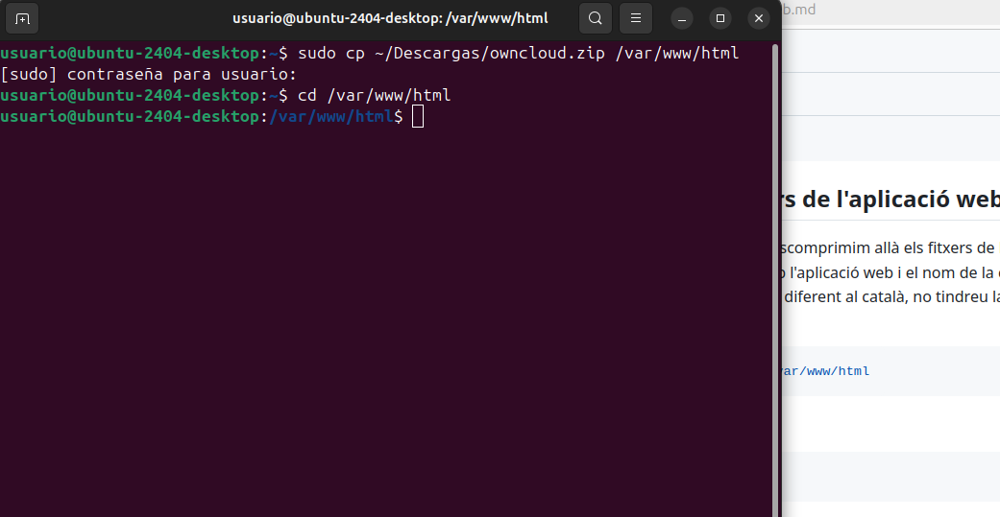
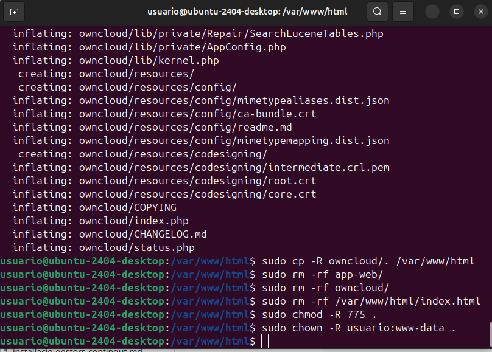

# Asi los descargue yo
Primero de todo descargue el archivo comprimido del cloud, y hice estos pasos:
  

# Despues de a ver movido el archivo y descomprimirlo toco, dar los permisos al LocalHost y todo lo suficiente para que funcione:
  

# Ahora que tenemos todos estos pasos ponemos en Google "LocalHost"

Necesitariamos ahora una cuenta de Myql entonces para crear nuestra propia cuenta tenemos que poner un usuario,contraseña,data base etc, para poder crearnos nuestra cuenta para el NextCloud/OwnCloud
