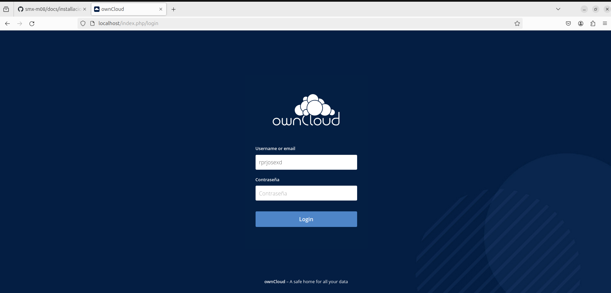

# Asi los descargue yo
Primero de todo descargue el archivo comprimido del cloud, y hice estos pasos:
  

Despues de a ver movido el archivo y descomprimirlo toco, dar los permisos al LocalHost y todo lo suficiente para que funcione:
  

Ahora que tenemos todos estos pasos ponemos en Google "LocalHost"

