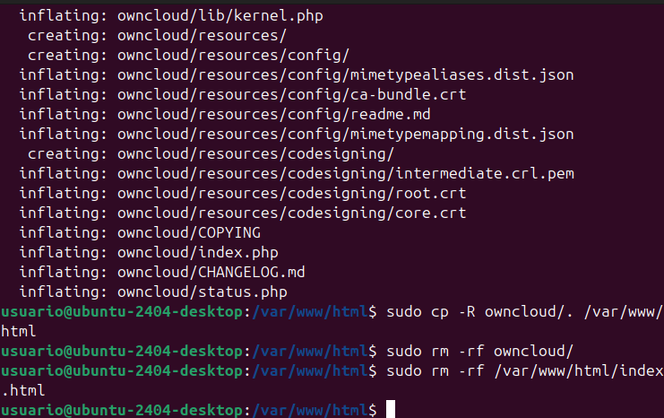

# nextcloud-Owncloud Tutorial!

1- lo primero de todo, nos iremos al tutorial de la cuenta de Rusben, para saber como instalar el next Cloud/OwnCloud, y lo que se necesita.
https://github.com/rusben/smx-m08/blob/main/docs/installacio-aplicacions-web.md

2- Despues utilizaremos estas comandas para actualizar el software, y crearnos una cuenta de Myql

- sudo mysql
- CREATE DATABASE bbdd;
- CREATE USER 'usuario'@'localhost' IDENTIFIED WITH mysql_native_password BY 'password';
- GRANT ALL ON bbdd.* to 'usuario'@'localhost';
Haciendo esos pasos ya tendriamos una cuenta de Mysq1

3- Ahora debemos descargar el archivo y cambiarle el Nombre, a App Web el Next Cloud, y el OwnCloud el Own, tenemos que mover esos archivos a esta ruta: cd /var/www/html
Moviendolos vamos a Descomprimirlos, y despues eliminaremos las 2 carpetas por que ya tendriamos los archivos importantes para poder descargars los Clouds.

- sudo unzip app-web.zip / sudo unzip OwnCloud.zip
- sudo cp -R app-web/. /var/www/html / sudo cp -R OwnCloud/. /var/www/html
- sudo rm -rf app-web/
- sudo rm -rf /var/www/html/index.html

  

La imagen enseña sobre el OwnCloud, pero seria lo mismo con NextCloud

4- Ahora por ultimo solamente tendriamos que buscar en Google: ¨LocalHost¨ y deberia aparecer esto:

5- Pondriamos los datos que creamos antes del Usuario y Password, y eso ya seria todo tendriamos instalado uno de los dos Clouds, y siguiendo estos mismos pasos con el otro tambien deberia instalarnos la otra nube.
